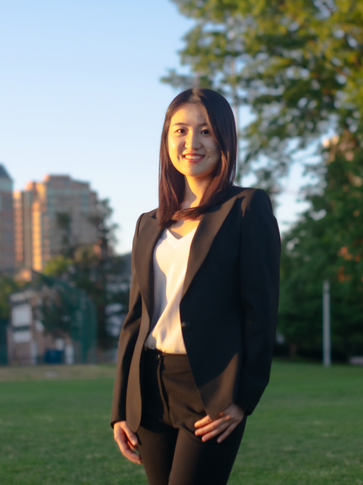

I am an Assistant Professor of Political Science at the University of California, Los Angeles. I received my Ph.D. from the Department of Political Science at Washington University in St. Louis in 2022. I also hold a B.A. in international Politics and a B.A. in Journalism & Communication (with honors) from Tsinghua University. 

I study international relations, with a focus on civil conflict and political violence, and quantitative political methodology. Specifically, my research examines how militant organizations propagate ideologies to mobilize, recruit, and exercise control over individual members and how these ideological strategies fit into the groups' broader military agendas. Corresponding to this focus on ideology, my methodological work advances text-as-data methods that facilitate the measurement of ideology from text corpora. Another set of projects analyze the importance of territorial control for states and non-state groups in conflict. This research spans my work on the determinants of transnational terrorism, the consequences of modern state expansion, as well as the historical legacies of border institutions. Overall, my research provides a more comprehensive understanding of modern warfare and the violent actors involved.

I received the 2022 Peace Science Society (International) Walter Isard Award for the best dissertation in Peace Science (over a 2 year period). My papers have been awarded the Best Paper in International Relations Award, the Pi Sigma Alpha Award for the best paper presented at the 2019 MPSA Conference, and the Best Poster Award (Application) at the PolMeth XXXVII Summer Meeting. My published work has appeared in <i>American Political Science Review</i>, <i>Political Analysis</i> and the <i>Journal of Conflict Resolution</i>.
